# Connect

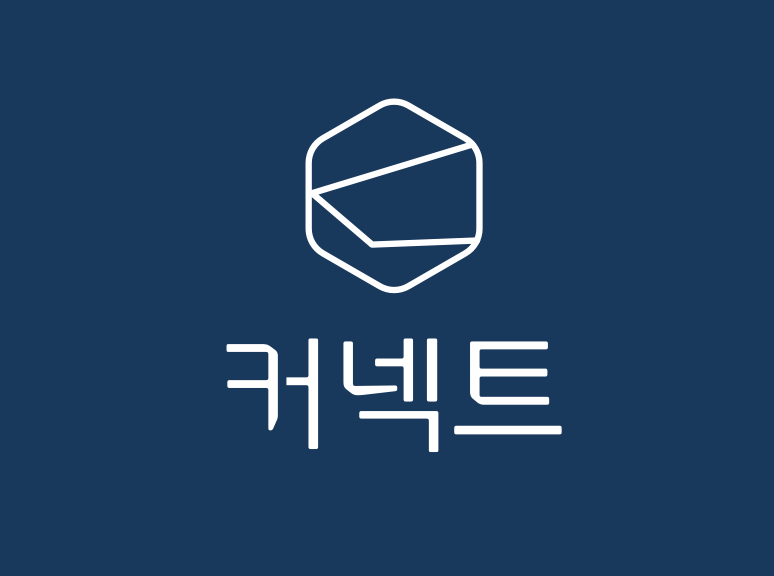

내 손 안의 전자명함, 커넥트(Connect)

## 프로젝트 소개

커넥트(Connect)는 나만의 명함을 직접 만들고, SNS를 통해 명함을 전달하거나 공유할 수 있는 전자명함 어플리케이션입니다.

이러한 서비스를 통해 기존 종이 명함의 단점인 무분별한 자원 사용을 줄일 수 있으며, 누구나 금전적인 부담 없이 자신만의 명함을 만들 수 있습니다.

또한 SNS 플랫폼을 통한 공유 기능으로 명함을 교환하고 전달하는 절차를 단축할 수 있으며, 직접 만나지 않아도 자신의 명함을 전달하거나 교환할 수 있어 사용자의 스마트한 명함 관리를 도와줄 것입니다.

## 개발 일정

- 2019 EDCAN 6기 여름방학 프로젝트 (~2019/8/15)

## 만든 사람들

- Android Developer, 정찬효
- Backend Developer, 김도영
- UI Designer, 김민

## 스크린샷

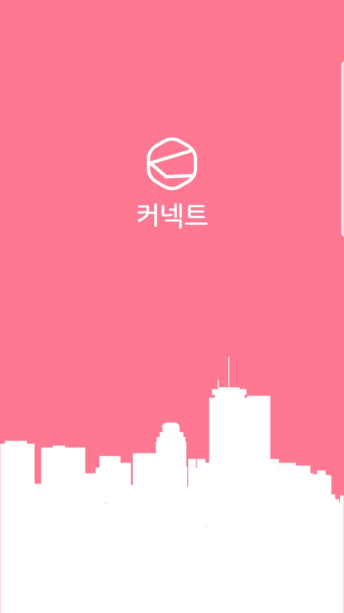
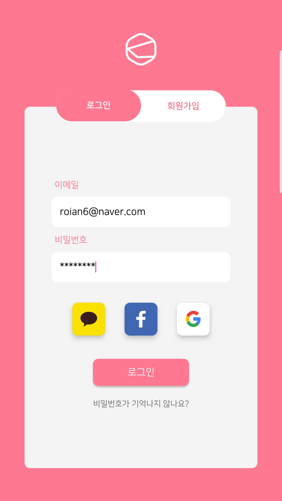
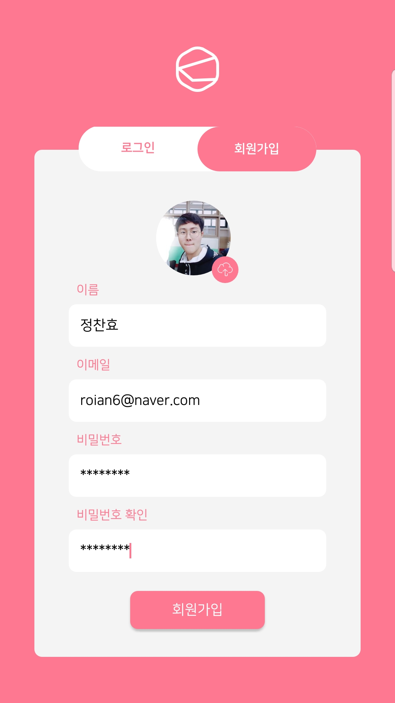
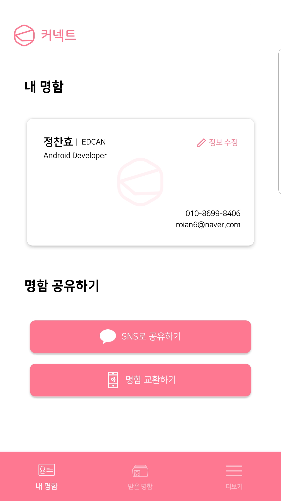

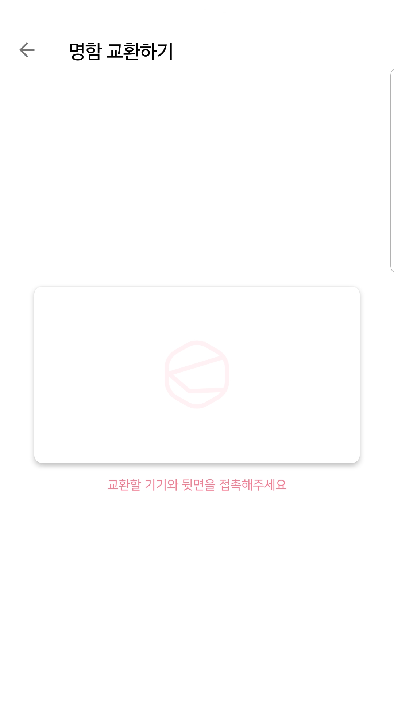
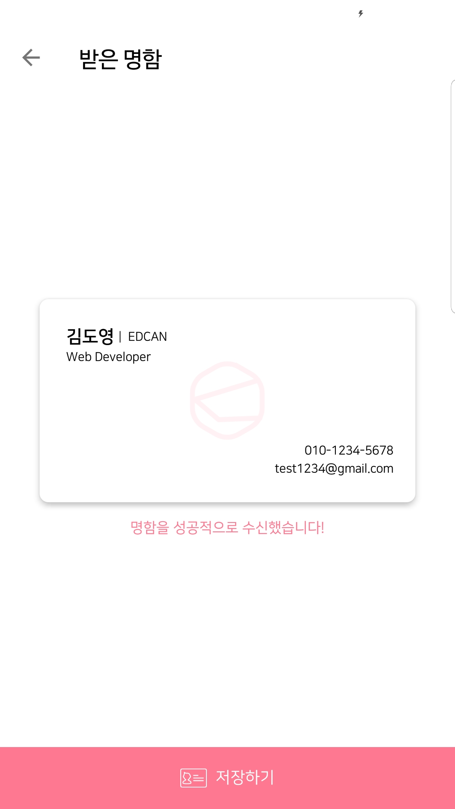
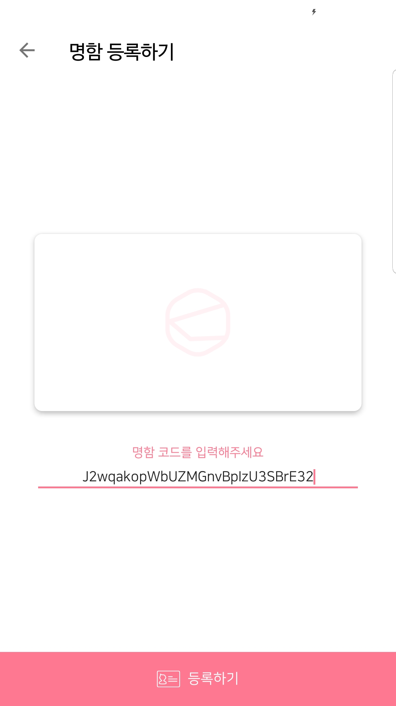
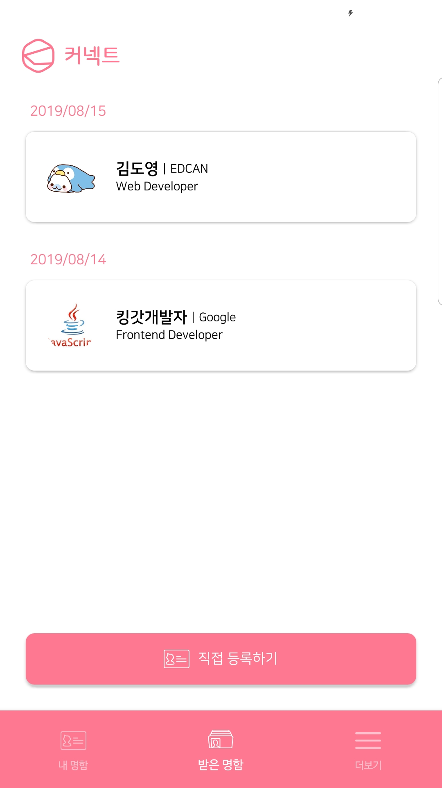
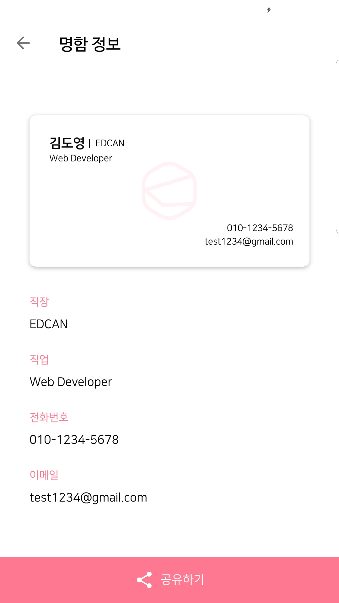

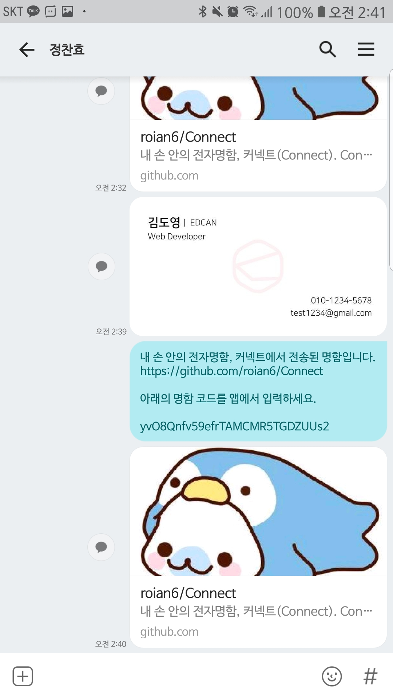
